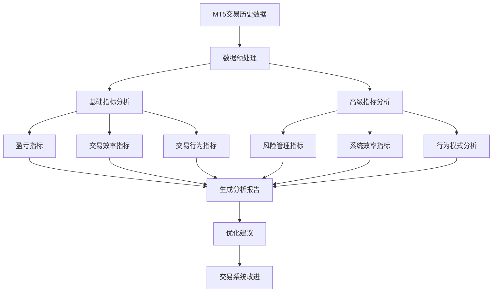

# MT5 交易历史数据分析指标

## 1. 基础交易指标

### 1.1 盈亏指标
- 总盈亏金额
- 盈亏比率
- 单笔最大盈利/亏损
- 平均每笔交易盈亏
- 累计净值曲线

### 1.2 交易效率指标
- 胜率
- 盈亏比
- 最大回撤
- 夏普比率
- 收益风险比

### 1.3 交易行为指标
- 交易频率
- 持仓时间分布
- 交易量分析
- 交易时间分布
- 交易品种分布

## 2. 高级分析指标

### 2.1 风险管理指标
- 风险回报比
- 每笔交易风险百分比
- 最大连续亏损次数
- 资金曲线回撤分析
- 波动率分析

### 2.2 交易系统效率指标
- 系统期望值
- 利润因子
- 恢复因子
- 绝对回撤值
- 相对回撤比例

### 2.3 交易行为模式分析
- 交易品种相关性
- 交易时间效率分析
- 持仓时间与盈亏关系
- 交易规模与盈亏关系
- 市场条件相关性

## 3. 数据分析流程图


## 4. 分析建议

### 4.1 数据收集
- 确保数据完整性和准确性
- 建立统一的数据格式
- 定期备份交易历史数据

### 4.2 定期分析
- 每日交易总结
- 每周交易回顾
- 月度系统评估
- 季度策略调整

### 4.3 优化方向
- 基于胜率和盈亏比优化交易系统
- 根据回撤控制调整仓位管理
- 分析最佳交易时间段
- 优化交易品种选择
- 改进风险管理策略

## 5. 实施建议

### 5.1 技术实现
1. 使用 Python 进行数据处理和分析
2. 建立自动化分析报告系统
3. 开发可视化监控面板
4. 设置关键指标预警机制

### 5.2 定期回顾
1. 每日交易日志记录
2. 周度指标分析
3. 月度系统评估
4. 季度策略调整

### 5.3 持续优化
1. 根据分析结果不断调整交易策略
2. 优化风险管理参数
3. 改进交易系统性能
4. 适应市场变化调整策略

## 6. 指标计算公式和代码实现

### 6.1 基础交易指标计算

#### 6.1.1 盈亏指标计算
python
import pandas as pd
import numpy as np
def calculate_profit_metrics(trades_df):
"""
计算基础盈亏指标
trades_df: DataFrame包含列：profit, volume, open_time, close_time
"""
metrics = {
# 总盈亏金额
'total_profit': trades_df['profit'].sum(),
# 盈亏比率
'profit_ratio': len(trades_df[trades_df['profit'] > 0]) / len(trades_df[trades_df['profit'] < 0]),
# 单笔最大盈利/亏损
'max_profit': trades_df['profit'].max(),
'max_loss': trades_df['profit'].min(),
# 平均每笔交易盈亏
'avg_profit': trades_df['profit'].mean()
}
return metrics

#### 6.1.2 交易效率指标计算
python
def calculate_efficiency_metrics(trades_df):
    """
    计算交易效率指标
    """
    # 胜率计算
    win_rate = len(trades_df[trades_df['profit'] > 0]) / len(trades_df)
    
    # 盈亏比计算
    avg_profit = trades_df[trades_df['profit'] > 0]['profit'].mean()
    avg_loss = abs(trades_df[trades_df['profit'] < 0]['profit'].mean())
    profit_loss_ratio = avg_profit / avg_loss if avg_loss != 0 else float('inf')
    
    # 最大回撤计算
    def calculate_max_drawdown(equity_curve):
        rolling_max = equity_curve.cummax()
        drawdowns = equity_curve - rolling_max
        max_drawdown = drawdowns.min()
        return max_drawdown
    
    # 夏普比率计算
    def calculate_sharpe_ratio(returns, risk_free_rate=0.02):
        excess_returns = returns - risk_free_rate/252  # 假设交易日为252天
        return np.sqrt(252) * excess_returns.mean() / excess_returns.std()
    
    return {
        'win_rate': win_rate,
        'profit_loss_ratio': profit_loss_ratio,
        'max_drawdown': calculate_max_drawdown(trades_df['profit'].cumsum()),
        'sharpe_ratio': calculate_sharpe_ratio(trades_df['profit'].pct_change())
    }

### 6.2 高级分析指标计算

#### 6.2.1 风险管理指标

def calculate_risk_metrics(trades_df):
    """
    计算风险管理相关指标
    """
    # 风险回报比
    risk_reward_ratio = trades_df['profit'].mean() / trades_df['profit'].std()
    
    # 最大连续亏损次数
    def max_consecutive_losses(trades):
        losses = (trades['profit'] < 0).astype(int)
        return max(len(list(g)) for k, g in itertools.groupby(losses) if k == 1)
    
    # 波动率分析
    volatility = trades_df['profit'].std()
    
    return {
        'risk_reward_ratio': risk_reward_ratio,
        'max_consecutive_losses': max_consecutive_losses(trades_df),
        'volatility': volatility
    }

#### 6.2.2 交易系统效率指标

def calculate_system_metrics(trades_df):
    """
    计算交易系统效率指标
    """
    # 利润因子
    profit_factor = abs(trades_df[trades_df['profit'] > 0]['profit'].sum() / 
                       trades_df[trades_df['profit'] < 0]['profit'].sum())
    
    # 恢复因子
    def recovery_factor(trades):
        total_profit = trades['profit'].sum()
        max_drawdown = calculate_max_drawdown(trades['profit'].cumsum())
        return abs(total_profit / max_drawdown) if max_drawdown != 0 else float('inf')
    
    # 系统期望值
    expectancy = (trades_df['profit'].mean() * len(trades_df[trades_df['profit'] > 0]) -
                 abs(trades_df['profit'].mean() * len(trades_df[trades_df['profit'] < 0]))) / len(trades_df)
    
    return {
        'profit_factor': profit_factor,
        'recovery_factor': recovery_factor(trades_df),
        'expectancy': expectancy
    }

### 6.3 使用示例

```python
# 使用示例
def analyze_mt5_history(trades_df):
    """
    综合分析MT5交易历史
    """
    # 基础指标分析
    profit_metrics = calculate_profit_metrics(trades_df)
    efficiency_metrics = calculate_efficiency_metrics(trades_df)
    
    # 高级指标分析
    risk_metrics = calculate_risk_metrics(trades_df)
    system_metrics = calculate_system_metrics(trades_df)
    
    # 生成分析报告
    report = {
        'basic_metrics': profit_metrics,
        'efficiency_metrics': efficiency_metrics,
        'risk_metrics': risk_metrics,
        'system_metrics': system_metrics
    }
    
    return report

# 使用pandas读取MT5导出的交易历史数据
def load_mt5_history(file_path):
    """
    加载MT5交易历史数据
    """
    df = pd.read_csv(file_path)
    # 确保必要的列存在
    required_columns = ['profit', 'volume', 'open_time', 'close_time']
    if not all(col in df.columns for col in required_columns):
        raise ValueError("Missing required columns in trade history file")
    
    return df
```

### 6.4 指标计算公式说明

1. **夏普比率 (Sharpe Ratio)**
   - 公式：SR = (Rp - Rf) / σp
   - Rp: 投资组合收益率
   - Rf: 无风险利率
   - σp: 收益率标准差

2. **最大回撤 (Maximum Drawdown)**
   - 公式：MDD = min((Vt - Vp) / Vp)
   - Vt: 当前价值
   - Vp: 之前的峰值

3. **利润因子 (Profit Factor)**
   - 公式：PF = |总盈利| / |总亏损|

4. **恢复因子 (Recovery Factor)**
   - 公式：RF = 净利润 / 最大回撤

5. **系统期望值 (System Expectancy)**
   - 公式：E = (Win% × Average Win) - (Loss% × Average Loss)

这些代码和公式提供了：
1. 完整的指标计算实现
2. 清晰的函数结构和注释
3. 实用的使用示例
4. 关键指标的计算公式说明

您可以直接使用这些代码来分析MT5的交易历史数据。需要注意的是：
1. 确保输入数据格式正确
2. 根据实际需求调整参数
3. 可能需要根据具体的MT5数据导出格式调整列名
4. 建议添加适当的错误处理机制

如果您需要特定指标的更详细实现或其他自定义指标，我很乐意为您提供更多帮助。
